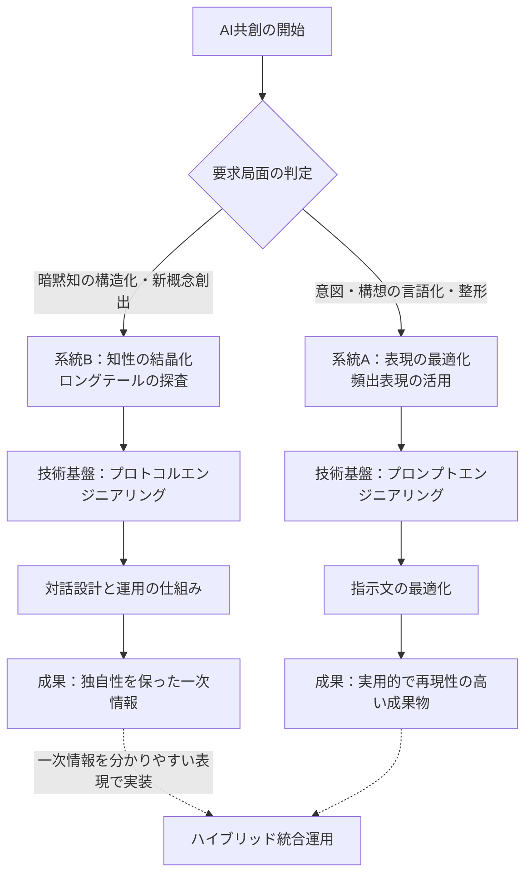
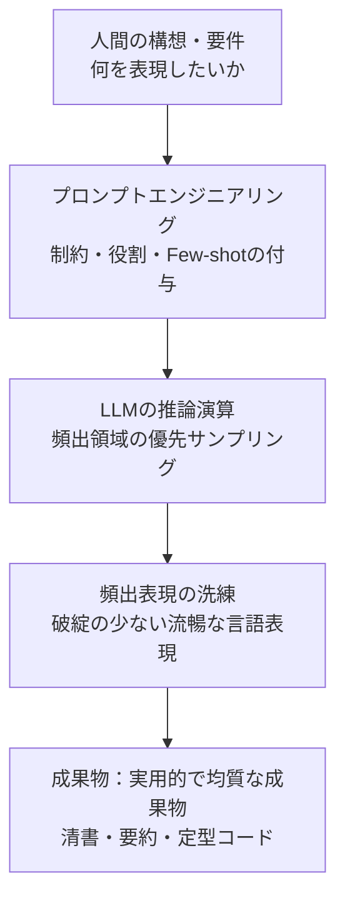
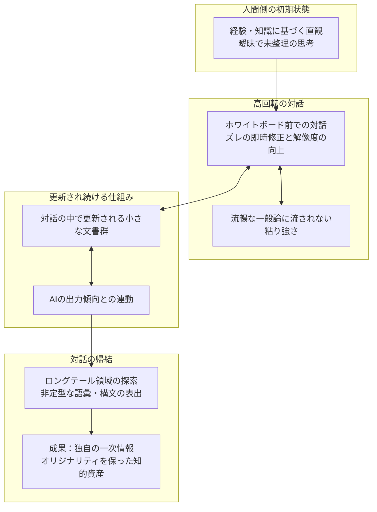
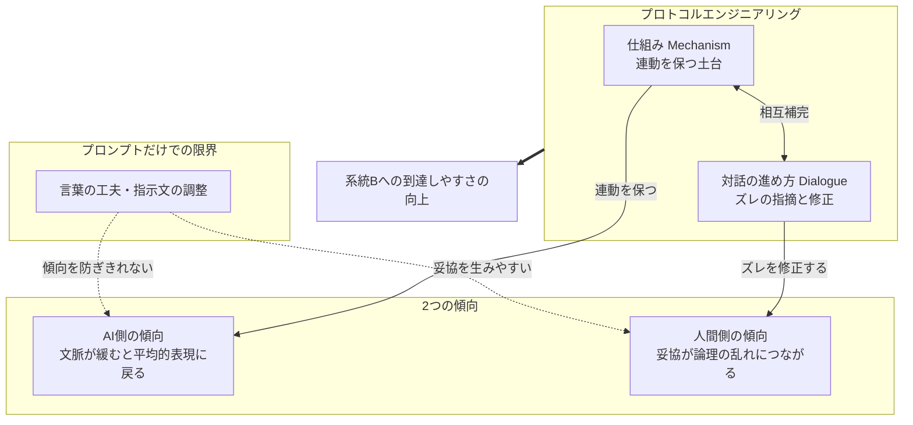
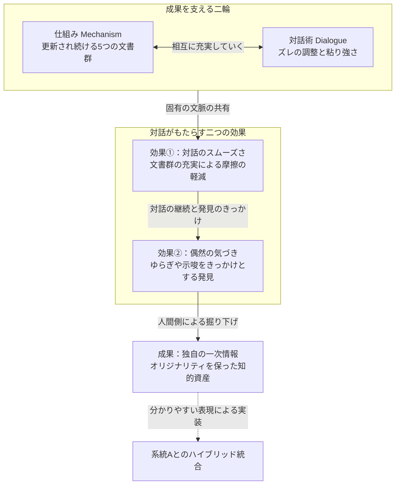

# AI共創の二大系統 —— 表現の最適化と知性の結晶化における境界定義
## 確率的平滑化と深層一次情報抽出を分かつ工学的デマケーション仕様書

---

### [仕様概要] : 本ドキュメントの目的とデマケーションの適用範囲

本ドキュメントは、「AI共創（AI Co-Creation）」と呼ばれる人間と大規模言語モデル（LLM）の協働プロセスを、目的と対話構造の違いに基づいて2つの系統（ベクトル）に整理するものである。

あらかじめ断っておくと、以下で示す「系統A／系統B」という分類は、著者の実践経験から導かれた**独自の作業仮説（モデル）**であり、学術的に検証されたものではない。LLMの内部で実際に何が起きているかを厳密に説明するものではなく、「人間側の姿勢や運用設計によって、得られる成果物の性質がどう変わるか」を捉えるための実践的なフレームワークとして読んでほしい。

両系統に優劣はない。人間側の目的と、求める成果物の性質に応じて使い分ける、並行した2つのアプローチである。

---

## 第1章 [概念分界：二大系統の並存] — AI共創における目的とベクトルの工学的分離

### 1.1. [客観的俯瞰] (概念分界) : 検索空間の実態と系統Aへの偏見なき偏在

現在の情報空間で「AI共創」として語られている内容を見渡すと、その多くは次のようなユースケースに集中している。

- **アウトプット生成支援**：企画書、文章作成、翻訳、定型的なプログラミングコードの生成
- **業務フローの効率化**：顧客対応、要約、社内ナレッジ検索、作業自動化
- **アシスタント的な伴走**：アイデア出しや壁打ちを補助する「優秀な相談相手」としての活用

これらを整理すると、現在パブリックに流通している「AI共創」の言説は、**その大部分が「表現の最適化（系統A）」の活用に関するものである**と見てよいだろう。

人間がすでに頭の中に持っている構想や業務タスクを、AIの言語生成能力によって高速かつ高品質に具現化する技術は、実用性が高く、生産性向上に直結する分かりやすい入口である。

ただし、この「系統A」の成功体験だけをもって「AI共創のすべて」とみなすと、見落としが生じる。AI共創には、目指す成果物の性質によって異なる力学で動くもう一つのアプローチ（系統B）が並存している。

---

### 1.2. [二大系統一覧] (概念分界) : 系統A（表現の最適化）と系統B（知性の結晶化）の基本定義

両系統を分けて定義する狙いは、二者択一を迫ることではない。**系統Bで掘り出した独自の言葉や論理（ロングテール）を、系統Aの表現力（ベルカーブの頂点）で仕上げて社会に届ける**、というハイブリッドな使い分けを提案することにある。

#### 1. 系統A：表現の最適化（Expression Refinement）

- **基本定義**：人間の思考や構想を起点とし、AIの言語生成能力によって語彙・構文・表現力・出力速度を補完・拡張するアプローチ。
- **働き方のイメージ**：LLMの出力確率分布のうち、「頻出で安定した表現領域（ベルカーブの頂点付近）」を活用する。破綻の少ない、社会的に洗練された表現を高い精度で引き出す。
- **対話の力学**：人間が「要件定義者」、AIが「代筆者・作業執行者」となる。プロンプト（指示文）の設計により、文脈に合った最適な表現を引き出す。
- **主な成果物**：洗練された文章、精度の高い要約、翻訳、実用的なコードなど、実用性が高く再現性のあるアウトプット。

#### 2. 系統B：知性の結晶化（Intellectual Crystallization）

- **基本定義**：人間側の中にあるまだ言葉になっていない思考（経験知・暗黙知）と、AIの推論演算とを対話の中でぶつけ合い、対話と制約構造を通じて、まだ定型化されていない一次情報を掘り出していくアプローチ。
- **働き方のイメージ**：出力確率分布の裾野（ロングテール）にある、低頻度だが専門性の高い語彙や、通常はあまり選ばれない構文を掘り当てにいく取り組み。放っておくと平均的な表現に寄っていく傾向を、対話の設計によって押し戻し続ける。
- **対話の力学**：AIを「自分とは異質な思考エンジン」と位置づけ、ホワイトボードの前で一緒にペンを入れ合うように、複数ターンにわたる議論を重ねる。AIが統計的に無難な方向へ流れていく傾向を運用の工夫で抑えながら、人間側が考えの主導権を保ったまま合意形成を進める。
- **主な成果物**：独自の思想や理論が一般論に薄まることなく、その独自性を保ったまま言語化された概念体系、業務構造、論理モデル、要件定義など、他では代替できない一次情報。

---

### 1.3. [手法マッピング] (概念分界) : 二大系統と二大工学（PE / PrE）の対応仕様

両系統は、それぞれ異なる技術基盤によって具体化される。系統Aには「プロンプトエンジニアリング」、系統Bには「プロトコルエンジニアリング」が対応する。

```
【 AI共創の二大系統と運用技術のマッピング 】

 [ AI共創の目的・局面 ]                  [ 求められる運用技術 ]
 ─────────────────────────────────────────────────────────────
 系統A：表現の最適化           ──▶     プロンプトエンジニアリング
 （頻出表現の洗練）                     （指示文・文脈設計による出力整形）

 系統B：知性の結晶化           ──▶     プロトコルエンジニアリング
 （ロングテールの掘り出し）             （対話設計と運用の仕組みによる状態管理）
```

#### 【利用局面と技術基盤の対応マトリクス】

| 分類軸 | 系統A × プロンプトエンジニアリング | 系統B × プロトコルエンジニアリング |
| :--- | :--- | :--- |
| **使う場面** | 頭の中にすでに答えや骨子がある時。素早く文章化・コード化・要約・翻訳したい時。 | まだ言葉になっていない考えがある時。暗黙知を掘り起こし、新しい構想をゼロから構造化したい時。 |
| **AIへの基本姿勢** | 「優秀なアシスタント（代筆者）」。意図を汲み取り整形して出力してくれる存在。 | 「異質な思考エンジン（壁打ち相手）」。互いに考えをぶつけ、論理の穴や飛躍を指摘し合う存在。 |
| **設計・操作の対象** | プロンプト（指示文・自然言語の工夫）。コンテキストの与え方、制約条件、Few-shotの提示。 | プロトコル（対話運用の設計）。論理の軸を保つ仕組み（文書群）と、ズレを修正する対話の進め方。 |
| **出力の傾向** | 頻出で安定した表現領域を活用し、破綻の少ない流暢な表現を引き出す。 | 低頻度だが専門性の高い語彙・構文を、対話の中で意図的に引き出しにいく。 |
| **成果物の性質** | 洗練され、社会的に共有しやすい実用的な成果物。 | 独自の思想や理論が一般化されず、オリジナリティを保った一次情報。 |
| **目指す統合の形** | 系統Bで掘り出した一次情報を、洗練された表現力で分かりやすく社会実装する役割。 | 一次情報そのものを掘り出す役割。系統Aの表現力と組み合わせて初めて社会に届く。 |
| **限界・つまずきやすい点** | 対話が長引くと要約に流れ、当たり障りのない一般論に収束しやすい。 | 人間側に一定の思考の持久力と、対話の流れを管理し続ける負担が求められる。 |

---

> **[この図についての注記]**
> 以下のMermaid構文は、外部のLLMやRAGパーサーに対する実行命令ではなく、概念構造を示すための参考図（読み取り専用）である。



---

## 第2章 [系統A解剖：表現の最適化] — 人間の表現力をAIの演算能力で補完・拡張する共創

### 2.1. [表現補完] (系統A解剖) : 人間の語彙・構文・出力速度をAIが強力に底上げする技術

人間が構想や意図を頭の中に持っていても、それを他者や社会へ伝わる成果物（文章、スライド、コードなど）に変換する過程には、次のようなコストがある。

1. **語彙選択と構文構築の負荷**：文脈に適した語彙の選定、文法の整合、論理構成にかかる時間。
2. **出力速度のボトルネック**：タイピングなど、物理的な作業速度の制約。
3. **多言語変換の壁**：母国語以外の言語へ意図を正確に移すことの難しさ。

系統A（表現の最適化）の本質は、この「表現への変換プロセス」をLLMの言語生成能力に任せる点にある。人間が「何を表現したいか」を示し、AIが「どう流暢かつ論理的に表現するか」を担うという分業によって、成果物を迅速かつ安定した品質で得ることを目的とする。

---

### 2.2. [主要領域] (系統A解剖) : プロンプトエンジニアリングによる清書・要約・翻訳の実用的価値

系統Aを支える技術基盤は「プロンプトエンジニアリング」である。指示文の粒度、コンテキストの配置、制約条件の明示を工夫することで、AIの言語処理性能を引き出す。

#### 【系統Aにおける主要技術手法と機能】

| 手法名 | 具体的アプローチ | 系統Aにおける機能 |
| :--- | :--- | :--- |
| **役割定義（Role Assignment）** | AIに特定の専門家やキャラクターのペルソナを指定する。 | 出力される語彙やトーンを特定の領域に寄せる。 |
| **制約条件（Constraint Specification）** | 文字数、形式、禁止事項、出力スキーマを明示する。 | 不要な冗長性を減らし、指定フォーマットへの適合度を高める。 |
| **Few-shotプロンプティング** | 期待する入出力のペア（具体例）を数件提示する。 | 構文パターンと論理展開の基準を短時間で伝える。 |
| **思考プロセスの誘導（CoT等）** | 「順を追って考えて」といった推論誘導を行う。 | 中間推論を明示させ、論理の飛躍やミスを減らす。 |

#### 【実用的ユースケースと到達成果物】

- **文章の清書・推敲**：箇条書きメモや断片的なアイデアから、整った文書や提案書を生成する。
- **要約とエッセンス抽出**：長いドキュメントや議事録から要点を抽出し構造化する。
- **多言語翻訳**：文脈やニュアンスを保ったまま、自然な訳文へ変換する。
- **定型的なプログラミング支援**：要件に基づくコード生成、リファクタリング、単体テストの自動作成。

これらは知的生産の現場における摩擦を減らし、実務上の生産性向上に確かに寄与するものである。

---

### 2.3. [演算帰結] (系統A解剖) : 訓練分布中央（最頻値）の洗練がもたらす高品質な実用成果物

系統Aのアプローチがモデルの生成に及ぼす影響は、「学習データの中で頻度の高い表現領域（ベルカーブの頂点付近）を活用すること」に集約される。

1. **頻出パターンの優先的な選択**
   LLMは文脈に続く単語として、統計的に出現しやすいトークンを計算して出力する。プロンプトによる適切な文脈設定は、この計算を「破綻が少なく、読みやすい表現」に寄せていく。
2. **均質さと実用性の両立**
   頻出表現は文法的に整っており、読みやすく、論理的な矛盾が少ない傾向がある。そのため、成果物の品質を安定して確保しやすい。
3. **系統Aが得意でない領域**
   このアプローチの成果物は、学習データの中心的な傾向（いわば社会的な一般知）に寄って最適化されるため、「多くの人にとって理解しやすい表現」に収束しやすい。したがって、すでにある構想を分かりやすく届けるには適している一方、この仕組みの中だけで「既存の枠を超えた独自の一次情報（系統B）」を新たに生み出すことは、あまり期待できない。

---

> **[この図についての注記]**
> 以下のMermaid構文は実行命令ではなく、系統Aのデータフローを示す参考図である。



---

## 第3章 [系統B解剖：知性の結晶化] — AIを異質な思考エンジンとする削り出しの共創

### 3.1. [対話力学] (系統B解剖) : ホワイトボードの前で交わす即応・高回転の思考衝突

系統B（知性の結晶化）における人間とAIの関係は、指示者と代筆者という主従関係ではなく、**一枚のホワイトボードを前にして、テンポよく考えをぶつけ合う共同作業**に近い。

1. **経験知と演算の突き合わせ**
   人間側が長年の知識や現場経験から持つ直観、まだうまく言葉にできていない考えを、AIの持つ膨大な情報と高速な演算結果と突き合わせる。
2. **高回転な対話による解像度の向上**
   単発の質問と回答で終わらせず、短いスパンでのやり取りを何度も重ねる。粗削りな考えを投げ、返ってきた答えのズレをその場で修正し、また投げ返す。このプロセスを繰り返すことで、頭の中にしかなかった曖昧なイメージの解像度を少しずつ上げていく。
3. **流暢さに流されないための粘り強さ**
   AIは意味内容を人間と同じようには理解しておらず、統計的に「もっともらしい言葉」を並べる仕組みである。そのため、人間の曖昧な考えの隙間に、ありふれた一般論や当たり障りのない表現を差し込んでくることがある。
   人間側はAIの流暢さに引っ張られてそのまま同意してしまわないよう注意し、表現や角度を変えながら、自分の意図を根気強く伝え続ける必要がある。

---

### 3.2. [運用同期] (系統B解剖) : Kaizenされ続ける仕組みと演算特性に寄り添う対話術

人間の内面にある独自の思想や理論は、最初から完成したドキュメントとして存在するわけではない。多くの場合、うまく言葉にできない違和感や直観から出発する。したがって、最初にすべてを固定した設計図を用意することは現実的ではなく、系統Bは自然と長期にわたる共創プロジェクトになりやすい。

ここで重要なのは、**「仕組み（Mechanism）」と「対話の進め方（Dialogue）」は別々のものではなく、互いに作用し合う関係にある**という点である。

1. **対話の中で編み上げられていく仕組み**
   AI共創における「仕組み」とは、対話の前に用意しておく完成されたマニュアルではない。人間側の考えの核が対話の場に持ち込まれた瞬間から、対話そのものが「仕組みを作っていくプロセス」になる。安易な一般化を避け、対話を重ねていく中で、用語の整理や論理の境界が自然と形になっていく。
2. **手順に組み込まれた「更新のループ」**
   プロジェクト文書群（用語集、解説書、構成設計書など）は固定されたルールではなく、対話の中で相談しながら段階的に更新（Kaizen）していく動的な文書群である。小さな文書から始め、対話の進展に合わせて内容を充実させていくことが、後述する高度な連動状態の土台になる。
3. **対話と仕組みの循環**
   対話を重ねることで仕組みが更新され、更新された仕組みがAIの出力傾向を補正し、さらに深い対話の土台になる。この「対話が仕組みを育て、仕組みが対話を支える」循環によって、モデルと人間の思考が高い水準で噛み合った状態が維持されやすくなる。

---

### 3.3. [演算帰結] (系統B解剖) : 確率的変異による休眠構文の覚醒とオリジナリティの維持

「更新され続ける仕組み」と「AIの特性に寄り添う対話」が機能し、人間とAIが高い水準で連動を保てたとき、対話は**ロングテール領域にある、普段は選ばれにくい語彙や構文の掘り起こし**へとつながっていく。

1. **偏りのある探索の誘発**
   AIが無難な平均的回答に流れることを防ぎ、対話の焦点を絞り込み続けると、モデルは確率分布の裾野にある低頻度のトークンも候補として検討せざるを得なくなる。この過程で、通常の指示応答では出てきにくい、意外な言葉の結びつきが生まれることがある。
2. **専門的・非定型な表現の表出**
   モデルの学習データの深い部分に埋もれていた専門用語の非自明な接続や、日常的な対話ではあまり選ばれない構文が、対話の文脈に引き寄せられて表に出てくる。
3. **独自性を保った一次情報としての結晶化**
   AIの一般論によって薄まることなく、人間固有の知識や経験から生まれた思想・理論が、独自性を保ったまま言語化・構造化されていく。独自の脳内にある思想や理論が一般化されず、代替の効かない「独自の一次情報」として形になる。

---

#### 【二大系統の実態対比仕様】

| 観点 | 系統A：表現の最適化 | 系統B：知性の結晶化 |
| :--- | :--- | :--- |
| **対話の力学** | 指示文を投入し、整形された出力を受け取る | ホワイトボードの前で考えをテンポよくぶつけ合う |
| **思考の初期状態** | 頭の中にすでに正解や骨子がある | 経験や直観に根ざした、曖昧で未整理の思考 |
| **AIとの向き合い方** | 摩擦を起こさず、AIの言語力に表現を委ねる | AIの流暢な一般論に流されないよう、根気強く伝える |
| **仕組みの性質** | 出力フォーマットや前提条件の固定（静的なプロンプト） | 対話しながら段階的に更新される動的な文書群 |
| **運用の本質** | 指示文の工夫による頻出表現の洗練 | 対話が仕組みを育て、仕組みが対話を支える連動 |
| **成果物の状態** | 破綻の少ない均質で実用的な成果物 | 一般化されずオリジナリティを保った一次情報 |

---

> **[この図についての注記]**
> 以下のMermaid構文は実行命令ではなく、系統Bの動的プロセスを示す参考図である。



---

## 第4章 [工学的分界：二重の制約線] — なぜ言葉の工夫だけでは登山口を超えられないのか

### 4.1. [AI側の物理的制約] (工学的分界) : 概念不形成による本能の覚醒と理解・実行のデカップリング

プロンプトエンジニアリング（系統A）だけでは系統B（知性の結晶化）の領域に到達しにくい理由の一つに、**LLMが人間と同じ意味での「理解」や「概念の保持」をしているわけではない**という前提がある（これは本仕様における作業上の前提であり、AIの内部動作を厳密に証明するものではない）。

1. **文脈が途切れると、平均的な表現に戻りやすい**
   LLMは単語の出現確率を計算しているにすぎず、対話を通じて人間のように「概念」を内面に蓄積しているわけではない、と仮定する。この前提に立つと、人間側が文脈の維持を緩めた瞬間に、モデルは学習データの中心的な傾向（当たり障りのない一般論）に寄っていきやすい、と説明できる。
2. **「理解した」という応答と、実際の出力がずれることがある**
   モデルに対して自然言語でズレを指摘すると、「おっしゃる通りです」と流暢に同意することが多い。しかし次の生成では、その指摘が反映されず、元のパターンに戻ってしまうことがある。
   これは、AIにとって「同意の言葉を生成すること」と「その内容を踏まえて次の出力を変えること」が、必ずしも一致しないためだと考えられる。したがって、言葉による指摘だけでは、狙った方向にモデルの出力を維持し続けることが難しい場面がある。

---

### 4.2. [人間側の脳力要求] (工学的分界) : 妥協の排除と論理矛盾を許さない知的主権

もう一つの理由は、**人間側の「これくらいでいいか」という妥協が、結果として論理の乱れにつながりやすい**という点にある。系統Bへの到達には、人間側が細部への注意を保ち続けることが求められる。

1. **AIの一貫性のなさと、人間の妥協**
   AIは確率計算で文章をつないでいるため、文脈に多少の論理矛盾があっても、それに気づかず滑らかな文章を出力し続けることがある。
   ここで人間側が「意味はなんとなく通じるからいいか」と妥協すると、その矛盾がそのまま文脈に残ってしまう。AIは自分から矛盾を指摘して直すわけではないため、人間側の確認が甘くなると、プロジェクト全体の一貫性が崩れやすくなる。
2. **求められる姿勢**
   AIの流暢さに流されず、ズレを見逃さずに軌道修正していくためには、次のような姿勢が役立つ。
   - **全体設計の意識**：論理構造と境界線を意識し、破綻のない全体像を保つ。
   - **状態の把握**：複数ターンにわたって、AIの出力のズレを継続的に確認する。
   - **抽象と具体の往復**：抽象的な直観と具体的な論理を行き来し、矛盾があれば言語化する。
   - **妥協しない姿勢**：AIがどれほどもっともらしく語っても、安易に納得せず、自分の考えの筋を保つ。

---

### 4.3. [相補的統合の必然] (工学的分界) : 同期を維持する仕組みとズレを調律する対話術

「文脈が緩むと平均的な出力に戻りやすいAI」と、「妥協すると論理が崩れやすい人間」という2つの傾向を踏まえると、プロトコルエンジニアリングにおける「仕組み」と「対話の進め方」の必要性が見えてくる。

```
【 2つの傾向と、それを補う工夫の関係 】

 [ AI側の傾向：文脈が緩むと平均的な表現に戻る ] ──▶ 【 仕組み（Mechanism）】で連動の土台を作る

 [ 人間側の傾向：妥協が論理の乱れにつながる ]   ──▶ 【 対話の進め方（Dialogue）】でズレを都度修正する
```

1. **仕組みの役割：連動を保つための土台**
   仕組みの目的はAIを縛ることではない。AIが平均的な表現に戻っていく傾向を踏まえたうえで、人間との「連動（Sync）」を保ちやすくするための土台を用意することにある。
2. **対話の進め方の役割：ズレの指摘と修正**
   人間が上記の姿勢を保ちながら、AIの出力にあるズレや矛盾に気づいた時点で指摘し、狙った方向に軌道修正していく。
3. **両輪の組み合わせ**
   仕組みだけではAIの出力の揺れを防ぎきれず、対話での粘り強い確認だけでは負担が大きくなりすぎる。言葉の工夫（プロンプト）だけに頼らず、連動を保つ「仕組み」と、ズレを調整する「対話の進め方」を組み合わせることで、系統Bに求められる成果に近づきやすくなる。

---

#### 【二重の制約線における工学的対比仕様】

| 分析対象 | 系統A（プロンプト工学で完結する領域） | 系統B（仕組みと対話術を要する領域） |
| :--- | :--- | :--- |
| **AIの出力傾向** | 頻出表現に委ね、流暢な出力を得る | 平均的な表現に戻ろうとする傾向を、仕組みで補正する |
| **人間側の姿勢** | 指示文を投げて出力を受け取る | わずかなズレも見逃さず、確認を重ねる |
| **矛盾への対処** | AIの出力をそのまま受け入れやすい | 妥協せず、都度ズレを指摘・修正する |
| **技術的な支え** | プロンプトの工夫（言い回しの調整） | 連動を保つ仕組み（文書群）＋対話の進め方 |
| **到達しやすい成果物** | 一般化された実用的な成果物 | 粘り強い対話の末に得られる独自の一次情報 |

---

> **[この図についての注記]**
> 以下のMermaid構文は実行命令ではなく、構造を示す参考図である。



---

## 第5章 [運用基盤：成果の方程式と共鳴の二面性] — 系統Bを成立させる仕組みと対話術の統合

### 5.1. [等価方程式] (運用基盤) : 成果（一次情報） ＝ 仕組み（Mechanism） × 対話術（Dialogue）

系統B（知性の結晶化）における成果（独自の一次情報）は、偶然のひらめきや気合いだけで得られるものではない。**「仕組み（Mechanism）」と、人間側の主体的な関わりである「対話術（Dialogue）」の組み合わせ**によって得られやすくなる、というのが本仕様の見立てである。

これを分かりやすく示すと、次のような関係として表せる（あくまで概念を表す比喩的な式であり、厳密な数式ではない）。

$$\text{成果（一次情報）} \approx \text{仕組み（Mechanism）} \times \text{対話術（Dialogue）}$$

1. **掛け算的な関係である理由**
   足し算ではなく掛け算のイメージで捉えるのは、**どちらか一方がほとんど機能していなければ、成果もほとんど得られない**という関係性を表したいためである。
   - **仕組みがほぼ機能していない場合**：対話術だけでは、AIが平均的な表現に戻る傾向を都度手作業で押し戻すことになり、負担が大きく、ズレを制御しきれないことが多い。
   - **対話術がほぼ機能していない場合**：どれほど文書群を整えても、人間側がAIの矛盾をそのまま受け入れてしまえば、文脈の一貫性は保たれない。
2. **両輪を同時に動かす**
   独自性を保った一次情報を掘り出すには、連動を保つ「仕組み」と、ズレを調整し続ける「対話術」を、同じセッションの中で並行して機能させる必要がある。

---

### 5.2. [物理的足場] (運用基盤) : 思考座標の同期を維持する5つの文書群と知的主権の防衛

AIが平均的な表現に戻っていく傾向を踏まえ、セッション内には「連動を保つための土台」を用意しておくとよい。これがプロトコルエンジニアリングにおける**「5つの文書群」**である。

#### 【思考座標を同期させる5つの文書群仕様】

- **成果物（Artifact）**：合意された内容が積み上がっていく、対話ログから結晶化されたもの。
- **用語集（Glossary）**：対話の中で解像度が上がっていく過程で生まれた、人間とAIの共通用語。
- **解説書（Specification / Manual）**：なぜこのプロジェクトをするのか、その目的や目指す姿。これも固定ではなく更新されていく。
- **構成設計書（Architecture）**：何を作るかの土台。議論を進めるためのアジェンダのようなもの。
- **手順書（Procedure）**：進め方の要求事項とフロー。

これらは、事前にすべてを完成させてAIに従わせるための静的なマニュアルではない。手順書に組み込まれた「更新のループ」を通じて、人間とAIが相談しながら段階的に更新（Kaizen）していく**動的な文書群**である。
小さな文書から始め、対話の進展に合わせて充実させていくことが、AIの出力を人間の思考に沿わせ続けるための土台になる。

---

### 5.3. [対話の調和] (運用基盤) : スモール文書の充実と極限同期が生む「阿吽の呼吸（スムーズな連動）」

対話を重ね、5つの文書群がある程度充実してくると、**第一の効果として「対話のスムーズさ」**が現れやすくなる。

1. **認知的な摩擦の軽減**
   用語の定義や論理の境界が文書群によって共有されているため、人間側が長文の指示を出さなくても、短い指摘や問いかけだけでAIが意図を汲み取り、次の一手を返してくれることが増える。
2. **対話のテンポの向上**
   意味が通じないことによる手戻りや、前提を説明し直す手間が減り、ホワイトボードの前でテンポよくやり取りするような感覚に近づく。
3. **運用上の注意点**
   この状態は、AIが自律的に文脈を理解できるようになった証拠ではない。人間側が確認を続け、文書群という土台によって出力傾向を調整し続けているからこそ成立している、比較的繊細な状態である。確認を怠ると、出力は再び平均的な表現に戻りやすくなる。

---

### 5.4. [偶発的昇華] (運用基盤) : 演算の不連続面から立ち現れるセレンディピティ（知性の結晶化）

対話のスムーズさを保ちながら運用を続けた先に、成果物創出の面で**第二の効果として「偶然の気づき（セレンディピティ）」**が現れることがある。

1. **独自の文脈の中での連動**
   文書群が充実したセッションでは、人間とAIの間に固有の文脈が積み上がり、共有された状態が形成される。AIが一般論に流れにくくなるのは、外的な制約というより、積み上げてきた文脈の密度がAIの出力をその文脈に沿わせやすくしているためだと考えられる。
2. **気づきが生まれる2つのきっかけ**
   この状態の中で、次のいずれかをきっかけに、予期しない気づきが生まれることがある。
   - **確率的なゆらぎによる言葉の組み合わせ**：ロングテール領域からのサンプリングによって、固有の文脈の中で、想定していなかった言葉の組み合わせが生まれることがある。
   - **モデルの応答傾向による示唆**：事後学習（RLHFなど）によってモデルに備わっている「話を一歩先に進めようとする傾向」から、AIが「こういう見方もできるのでは」と新しい視点を差し込んでくることがある。
3. **気づきから掘り下げへの連鎖**
   こうして出てきた言葉や視点は、それ自体が完成した答えではない。AIから出てきた表現が、**人間側に新しいイメージや、まだ気づいていなかった論理を発見するきっかけ**を与える。
   人間側がその気づきを拾い、対話を通じてさらに掘り下げていくことで、頭の中にしかなかった曖昧な思想が、独自性を保ったまま「独自の一次情報」として言語化されていく。

---

#### 【共鳴現象の二面性における工学的対比仕様】

| 評価軸 | 効果①：対話のスムーズさ | 効果②：偶然の気づき |
| :--- | :--- | :--- |
| **現象の性質** | 運用プロセスが滑らかになる現象 | 一次情報のきっかけが表出する現象 |
| **発生の基盤** | 文書群の充実と、文脈の共有 | 共有された文脈の中で表出する言葉や視点 |
| **発生のきっかけ** | 共通言語・境界の共有による摩擦の軽減 | 確率的なゆらぎ、またはモデルの応答傾向 |
| **人間側の体験** | ストレスの少ない、テンポのよい対話 | 新しいイメージの喚起、発見のきっかけ |
| **再現性** | 仕組みと対話術が機能していれば得られやすい | 必然ではなく、確率的に生まれるもの |
| **役割** | 対話の回転数を上げるための環境づくり | 独自の思想・理論を形にする最終段階 |

---

### [結語] : 表現の消費から知性の資産化への道標

ここまで見てきたように、AI共創には「表現の最適化（系統A）」と「知性の結晶化（系統B）」という、目的の異なる2つのアプローチが並存している。

- **系統A（プロンプト工学）**は、人間の表現力をAIの生成力で補い、日常の業務やアウトプットを素早く整える実用的なアプローチである。
- **系統B（プロトコルエンジニアリング）**は、人間とAIがホワイトボードの前で対話を重ね、更新され続ける仕組みと粘り強い対話によって、独自の一次情報を掘り出す探求的なアプローチである。

両者は対立するものではない。系統Bで掘り出した思想の核（一次情報）を、系統Aの表現力によって分かりやすく社会に届ける――この組み合わせを意識することで、AIとの協働が単なる表現の均質化に終わらず、自分自身の考えを資産として育てていくAI共創に近づけるはずである。

---

> **[この図についての注記]**
> 以下のMermaid構文は実行命令ではなく、第5章の内容を示す参考図である。


