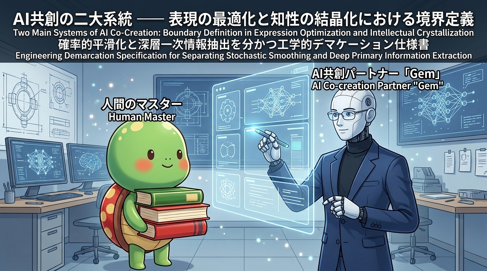
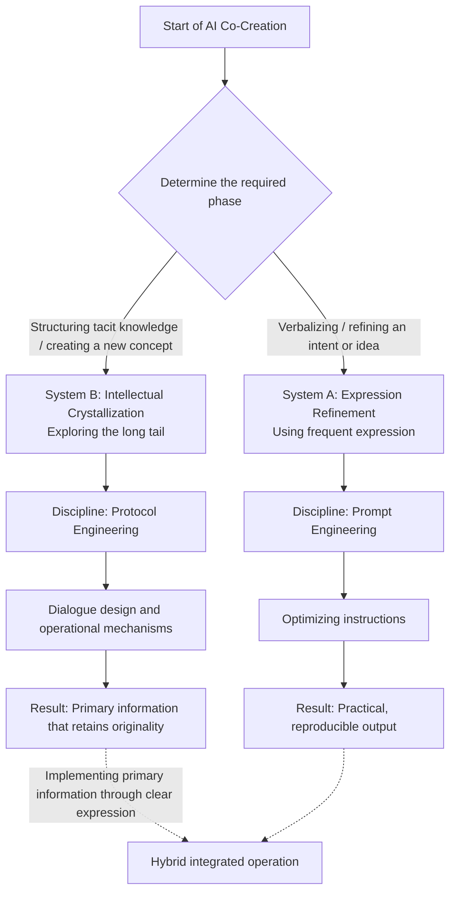
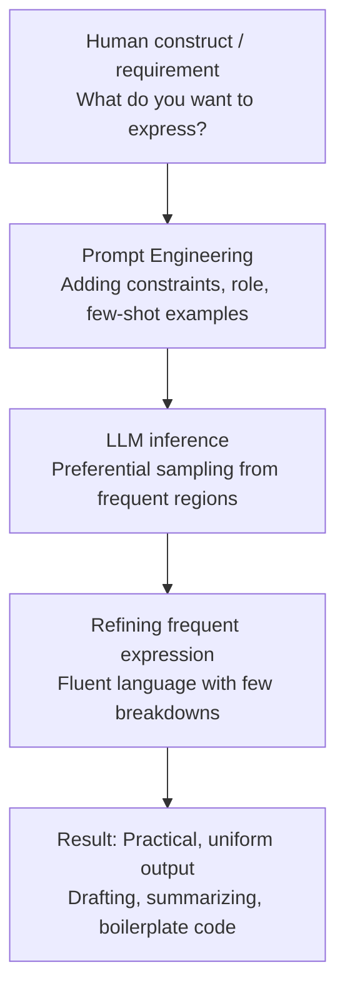
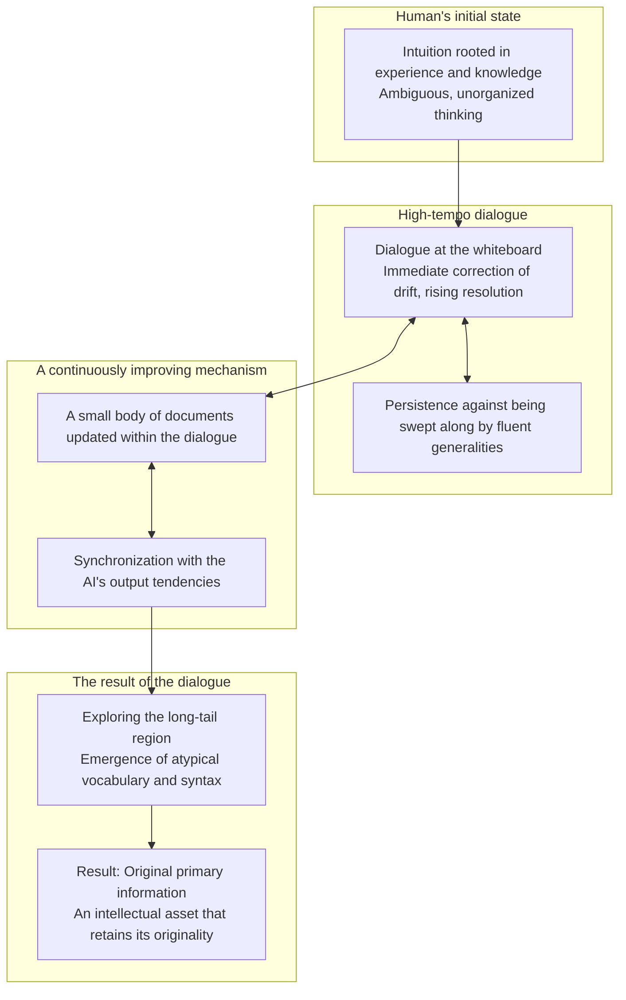
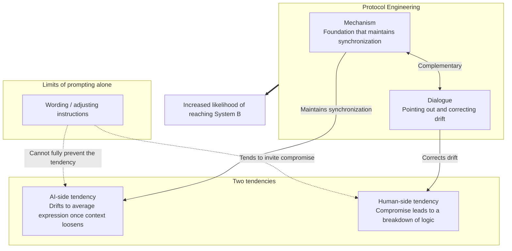
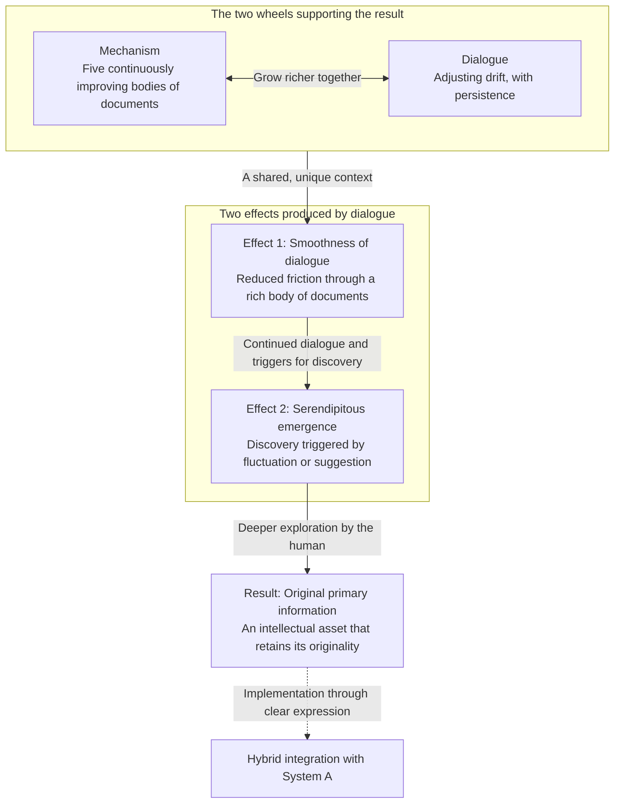

<!-- Header Image Asset (Inline CSS specification with fallback) -->
<div style="width: 100%; max-width: 100%; margin-bottom: 48px; box-sizing: border-box;">
  
  <div style="display: none; width: 100%; height: 200px; border: 1px dashed rgba(255, 255, 255, 0.1); border-radius: 8px; align-items: center; justify-content: center; color: #94a3b8; font-size: 13px; font-weight: 600;">[ Two Vectors of AI Co-Creation Header Image ]</div>
</div>

# The Two Systems of AI Co-Creation —— Demarcating Expression Refinement and Intellectual Crystallization
## An Engineering Demarcation Specification Separating Probabilistic Smoothing from Deep Primary-Information Extraction

---

### [Overview] : Purpose and Scope of This Document

This document organizes the collaborative process between humans and large language models (LLMs) — commonly referred to as "AI Co-Creation" — into two systems (vectors), based on differences in purpose and dialogue structure.

A caveat up front: the "System A / System B" classification presented below is an **original working hypothesis (model)** derived from the author's practical experience. It has not been academically verified. It does not claim to precisely explain what is actually happening inside an LLM; rather, it should be read as a practical framework for capturing how the nature of the resulting output changes depending on the human's stance and how the collaboration is designed.

Neither system is superior to the other. They are two parallel approaches, to be chosen based on the human's purpose and the nature of the desired output.

---

## Chapter 1 [Conceptual Demarcation: The Coexistence of Two Systems] — Engineering Separation of Purpose and Vector in AI Co-Creation

### 1.1. [Objective Overview] (Conceptual Demarcation) : The State of the Search Space and Its Bias Toward System A

Looking across how "AI Co-Creation" is currently discussed in the information space, most of it concentrates on the following use cases.

- **Output generation support**: proposals, writing, translation, generating boilerplate programming code
- **Workflow efficiency**: customer support, summarization, in-house knowledge search, task automation
- **Assistant-style collaboration**: using AI as a "capable sounding board" to help with brainstorming or thinking out loud

Organizing these observations, it is reasonable to conclude that **the majority of the "AI Co-Creation" discourse currently in public circulation concerns the use of "Expression Refinement (System A)."**

The technology that lets a human quickly and reliably turn a construct or task already formed in their head into an output — using the AI's language generation capability — is highly practical and a clear entry point that translates directly into productivity gains.

However, treating this success story of "System A" alone as "the whole of AI Co-Creation" causes something to be overlooked. AI Co-Creation also has a second approach (System B), which runs on a different dynamic depending on the nature of the output being pursued, and which coexists alongside System A from the outset.

---

### 1.2. [Overview of the Two Systems] (Conceptual Demarcation) : Basic Definitions of System A (Expression Refinement) and System B (Intellectual Crystallization)

The aim of defining the two systems separately is not to force a binary choice. It is to propose a hybrid use case: **taking the original words and logic unearthed by System B (the long tail) and finishing them with System A's expressive power (the peak of the bell curve) to deliver them to the world.**

#### 1. System A: Expression Refinement

- **Basic definition**: An approach that starts from human thought or intent, using the AI's language generation capability to supplement and extend vocabulary, syntax, expressive power, and output speed.
- **How it works**: It draws on the "frequent and stable region of expression (near the peak of the bell curve)" within the LLM's output probability distribution, extracting fluent, socially refined expression with high precision and few breakdowns.
- **Dialogue dynamic**: The human acts as the "requirements definer," and the AI as the "ghostwriter / task executor." Prompt design draws out the expression that best fits the context.
- **Primary output**: Polished writing, high-precision summaries, translation, practical code — output that is highly practical and reproducible.

#### 2. System B: Intellectual Crystallization

- **Basic definition**: An approach in which the not-yet-verbalized thinking inside a person (experiential knowledge, tacit knowledge) is brought into direct contact with the AI's inferential computation through dialogue, and — through that dialogue and a supporting constraint structure — not-yet-formalized primary information is gradually unearthed.
- **How it works**: An effort to dig into the low-frequency but highly specialized vocabulary and rarely-selected syntax that sits in the tail of the output probability distribution (the "long tail"). Left unattended, output tends to drift toward the average; dialogue design is used to continually push back against that drift.
- **Dialogue dynamic**: The AI is treated as "a thinking engine unlike oneself," and the human and AI hold a multi-turn discussion, as if standing in front of a whiteboard and taking turns with the pen. The human keeps hold of the intellectual initiative, using operational techniques to hold back the AI's tendency to drift toward safe, statistically average answers, while working toward a deep agreement.
- **Primary output**: A conceptual framework, operational structure, logical model, or requirements definition in which a person's own thinking or theory is verbalized while retaining its originality — irreplaceable primary information that is not diluted into generalities.

---

### 1.3. [Method Mapping] (Conceptual Demarcation) : The Correspondence Between the Two Systems and Two Engineering Disciplines (PE / PrE)

Each system is realized through a different underlying technical discipline. System A corresponds to "Prompt Engineering," and System B corresponds to "Protocol Engineering."

```
[ Mapping the Two Systems of AI Co-Creation to Their Operational Disciplines ]

 [ Purpose / Phase of AI Co-Creation ]        [ Required Operational Discipline ]
 ─────────────────────────────────────────────────────────────
 System A: Expression Refinement    ──▶     Prompt Engineering
 (Refining frequent expression)              (Shaping output through instructions and context design)

 System B: Intellectual Crystallization ──▶  Protocol Engineering
 (Unearthing the long tail)                  (State management through dialogue design and operational mechanisms)
```

#### 【Correspondence Matrix: Use Cases and Underlying Discipline】

| Axis | System A × Prompt Engineering | System B × Protocol Engineering |
| :--- | :--- | :--- |
| **When to use it** | When an answer or outline already exists in your head — when you want to quickly turn it into text, code, a summary, or a translation. | When you have a thought that has not yet been put into words — when you want to excavate tacit knowledge or structure a new idea from scratch. |
| **Basic stance toward the AI** | A "capable assistant (ghostwriter)": something that grasps your intent and formats it into output. | "A thinking engine unlike oneself (a sparring partner)": something you and the AI push back and forth against, pointing out gaps and leaps in each other's logic. |
| **What is being designed / operated on** | The prompt (instructions, natural-language phrasing): how context is provided, constraints, few-shot examples. | The protocol (the design of how the dialogue is run): a mechanism (a body of documents) that holds the logical axis in place, and a way of conducting dialogue that corrects drift. |
| **Tendency of the output** | Draws on frequent, stable regions of expression to produce fluent output with few breakdowns. | Deliberately draws out low-frequency but highly specialized vocabulary and syntax through dialogue. |
| **Nature of the output** | Polished, practical output that is easy to share socially. | Primary information that retains its originality and resists generalization. |
| **Form of integration to aim for** | The role of implementing the primary information unearthed by System B into society, in a clear, refined form. | The role of unearthing the primary information itself — it only reaches society once combined with System A's expressive power. |
| **Limits / common pitfalls** | Prolonged dialogue tends to drift into summarization and converge on inoffensive generalities. | Requires a certain amount of sustained mental stamina from the human, and the burden of continuously managing the flow of dialogue. |

---

> **[Note on this diagram]**
> The Mermaid syntax below is not an execution instruction for any external LLM or RAG parser; it is a reference diagram (read-only) showing the conceptual structure.



---

## Chapter 2 Dissecting System A: Expression Refinement

### 2.1. [Complementing Expression] (Dissecting System A) : How AI Powerfully Amplifies Human Vocabulary, Syntax, and Output Speed

Even when a person holds a construct or intent in their head, converting it into an output that can reach others or society (writing, slides, code, etc.) involves the following costs.

1. **The burden of vocabulary selection and sentence construction**: the time spent selecting vocabulary appropriate to the context, ensuring grammatical consistency, and structuring logic.
2. **The bottleneck of output speed**: the physical constraint of typing or writing speed.
3. **The barrier of multilingual conversion**: the difficulty of accurately transplanting intent into a language other than one's native tongue.

The essence of System A (Expression Refinement) lies in delegating this "conversion process into expression" to the LLM's language generation capability. Through a division of labor in which the human shows "what they want to express" and the AI handles "how to express it fluently and logically," the goal is to obtain output quickly and with stable quality.

---

### 2.2. [Key Areas] (Dissecting System A) : The Practical Value of Prompt Engineering for Drafting, Summarizing, and Translating

The technical discipline underlying System A is "Prompt Engineering." By refining the granularity of instructions, the placement of context, and the explicitness of constraints, it draws out the AI's language-processing performance at maximum efficiency.

#### 【Key Techniques and Functions in System A】

| Technique | Concrete approach | Function within System A |
| :--- | :--- | :--- |
| **Role Assignment** | Assigning the AI a specific expert or character persona. | Anchors the vocabulary and tone of the output to a specific domain. |
| **Constraint Specification** | Explicitly specifying character count, format, prohibitions, and output schema. | Reduces unnecessary verbosity and increases conformance to the specified format. |
| **Few-shot prompting** | Providing several examples of expected input–output pairs. | Quickly conveys the standard for syntax patterns and logical development. |
| **Guiding the reasoning process (CoT, etc.)** | Prompting with instructions such as "think step by step." | Makes intermediate reasoning explicit, reducing logical leaps and errors. |

#### 【Practical Use Cases and Attainable Outputs】

- **Drafting and polishing text**: generating a well-organized document or proposal from bullet-point notes or fragmentary ideas.
- **Summarization and extracting the essence**: extracting and structuring key points from long documents or meeting minutes.
- **High-precision multilingual translation**: converting text into a natural target-language expression while preserving context and nuance.
- **Boilerplate programming support**: generating code based on requirements, refactoring, and automatically creating unit tests.

These reliably reduce friction in knowledge work and contribute to real, practical productivity gains.

---

### 2.3. [Computational Outcome] (Dissecting System A) : The High-Quality, Practical Output — and Its Limits — Produced by Refining the Peak of the Training Distribution

The effect of System A's approach on the model's generation can be summarized as "drawing on the high-frequency region of expression within the training data (near the peak of the bell curve)."

1. **Preferential selection of frequent patterns**
   An LLM computes and outputs the token that is statistically most likely to follow the given context. Appropriate context-setting through prompting steers this computation toward "expression with few breakdowns that is easy to read."
2. **Balancing uniformity with practicality**
   Frequent expression tends to be grammatically correct, easy to read, and low in logical contradiction. As a result, the quality of the output is easy to secure consistently.
3. **Where System A is not well suited**
   Because the output of this approach is optimized around the central tendencies of the training data (in effect, socially common knowledge), it tends to converge toward "expression that is easy for most people to understand." It is therefore well suited to conveying an existing idea clearly, but this mechanism alone cannot be expected to newly generate "original primary information that goes beyond existing patterns (System B)."

---

> **[Note on this diagram]**
> The Mermaid syntax below is not an execution instruction; it is a reference diagram showing the data flow of System A.



---

## Chapter 3 Dissecting System B: Intellectual Crystallization

### 3.1. [Dialogue Dynamics] (Dissecting System B) : The Responsive, High-Tempo Collision of Thought at the Whiteboard

In System B (Intellectual Crystallization), the relationship between human and AI is not the master–ghostwriter relationship of instructor and executor; it is closer to **a joint effort in which the two stand at a whiteboard, taking turns quickly bouncing thoughts off each other.**

1. **Bringing experiential knowledge up against computation**
   The intuition a person has accumulated from years of knowledge and hands-on experience — thoughts not yet successfully put into words — is brought up against the AI's vast information and rapid computational results.
2. **Raising resolution through high-tempo dialogue**
   Rather than ending with a single question and answer, short exchanges are repeated many times in quick succession. A rough idea is thrown out, the discrepancy in the response that comes back is corrected on the spot, and it is thrown back again. Repeating this process gradually raises the resolution of an image that had previously existed only vaguely in one's head.
3. **The persistence needed to avoid being swept along by fluency**
   The AI does not understand meaning the way a human does; it is a system that statistically strings together "plausible-sounding words." Because of this, it can slip generic, inoffensive phrasing into the gaps of a person's still-ambiguous thinking.
   The human must be careful not to simply agree once swept along by the AI's fluency, and must keep conveying their intent persistently, varying the phrasing and angle as needed.

---

### 3.2. [Operational Synchronization] (Dissecting System B) : A Continuously Improving Mechanism and a Way of Conducting Dialogue Attuned to the AI's Characteristics

A person's own original thinking or theory does not exist from the outset as a finished document. In most cases, it starts from a discomfort or intuition that has not yet been successfully verbalized. Consequently, it is not realistic to prepare a fully fixed blueprint from the start, and System B naturally tends to become a long-term co-creation project.

What matters here is that **the "Mechanism" and the "way of conducting dialogue" are not separate things — they act on and reinforce each other.**

1. **A mechanism woven together within the dialogue**
   In AI Co-Creation, the "mechanism" is not a completed manual prepared before the dialogue begins. From the moment the core of a person's thinking is brought into the dialogue, the dialogue itself becomes "the process of building the mechanism." By avoiding easy generalization and continuing the dialogue, the organization of terms and the boundaries of logic naturally take shape.
2. **An "update loop" built into the procedure**
   The project's body of documents (glossary, specification, architecture document, etc.) is not a fixed set of rules; it is a dynamic body of documents that is updated step by step (Kaizen) through consultation within the dialogue. Starting from small documents and letting them grow richer as the dialogue progresses becomes the foundation for the advanced state of synchronization described later.
3. **The circulation between dialogue and mechanism**
   As the dialogue continues, the mechanism is updated; the updated mechanism corrects the tendency of the AI's output, which in turn provides a deeper foundation for dialogue. This circulation — "dialogue nurtures the mechanism, and the mechanism supports the dialogue" — makes it easier to maintain a state in which the model's and the human's thinking are engaged at a high level.

---

### 3.3. [Computational Outcome] (Dissecting System B) : The Awakening of Dormant Syntax Through Probabilistic Variation, and the Preservation of Originality

When the "continuously improving mechanism" and "dialogue attuned to the AI's characteristics" are functioning, and human and AI can sustain a high level of synchronization, the dialogue leads to **unearthing vocabulary and syntax from the long-tail region that is not normally selected.**

1. **Inducing a biased search**
   By preventing the AI from drifting toward safe, average answers and continuing to narrow the focus of the dialogue, the model is forced to also consider low-frequency tokens in the tail of the probability distribution as candidates. In this process, unexpected combinations of words can emerge that would not normally appear in an ordinary instruction–response exchange.
2. **The emergence of specialized, atypical expression**
   Non-obvious connections between technical terms buried deep in the model's training data, and syntax rarely selected in everyday dialogue, are drawn out into the context of the conversation and surface.
3. **Crystallization as primary information that retains its originality**
   Without being diluted by the AI's generalities, the thinking or theory born from a person's own unique knowledge and experience becomes verbalized and structured while retaining its originality. Thought that existed only inside one's own head takes shape as irreplaceable "primary information," without being generalized.

---

#### 【Comparison of the Two Systems in Practice】

| Perspective | System A: Expression Refinement | System B: Intellectual Crystallization |
| :--- | :--- | :--- |
| **Dialogue dynamic** | Input instructions and receive polished output | Bounce thoughts off each other at a good tempo, at the whiteboard |
| **Initial state of thought** | An answer or outline already exists in one's head | Ambiguous, unorganized thinking rooted in experience and intuition |
| **Stance toward the AI** | Delegate expression to the AI's language ability without friction | Convey intent persistently, without being swept along by the AI's fluent generalities |
| **Nature of the mechanism** | Fixed output format and preconditions (a static prompt) | A dynamic body of documents updated step by step through dialogue |
| **Essence of the operation** | Refining frequent expression through prompt design | The linkage of dialogue nurturing the mechanism and the mechanism supporting the dialogue |
| **State of the output** | Uniform, practical output with few breakdowns | Primary information that resists generalization and retains originality |

---

> **[Note on this diagram]**
> The Mermaid syntax below is not an execution instruction; it is a reference diagram showing the dynamic process of System B.



---

## Chapter 4 [Engineering Demarcation: The Double Constraint] — Why Wording Alone Cannot Get You Past the Trailhead

### 4.1. [The AI's Physical Constraint] (Engineering Demarcation) : The Awakening of "Instinct" Through a Lack of Concept Formation, and the Decoupling of Understanding from Execution

One reason Prompt Engineering (System A) alone struggles to reach the territory of System B (Intellectual Crystallization) rests on the premise that **an LLM does not "understand" or "retain concepts" in the same sense a human does** (this is a working premise for this specification, not a strict proof of the AI's internal operation).

1. **Output drifts back toward the average once context is loosened**
   We assume that an LLM merely computes the probability of the next word, and does not accumulate "concepts" internally through dialogue the way a human does. Under this assumption, the moment a human relaxes their effort to maintain context, the model tends to drift back toward the central tendencies of the training data (inoffensive generalities).
2. **A response of "understood" can diverge from the actual output**
   When a discrepancy is pointed out to the model in natural language, it often agrees fluently — "You're absolutely right." But in the next generation, that correction is sometimes not reflected, and the model reverts to its original pattern.
   This can be explained by the fact that, for the AI, "generating words of agreement" and "actually changing the next output based on that content" do not necessarily align. As a result, there are situations where verbal correction alone is not enough to keep the model's output on the intended track.

---

### 4.2. [The Cognitive Demand on the Human Side] (Engineering Demarcation) : Eliminating Compromise and Guarding Intellectual Sovereignty Against Logical Contradiction

The second reason is that **a person's compromise — settling for "close enough" — tends to accumulate into a breakdown of logic.** Reaching System B requires the human to sustain attention to detail.

1. **The AI's lack of consistency, and human compromise**
   Because the AI strings sentences together through probability calculation, it can keep producing smooth text even when there is some logical contradiction in the context, without noticing.
   If the human then compromises — "it more or less makes sense, so it's fine" — that contradiction remains fixed in the context as-is. Since the AI does not point out and correct its own contradictions on its own, if the human's checking becomes lax, the consistency of the whole project tends to break down.
2. **The attitude required**
   To avoid being swept along by the AI's fluency and to catch and correct drift, the following attitudes are helpful.
   - **Architectural awareness**: keeping the overall logical structure and boundaries in mind, preserving a coherent whole.
   - **State tracking**: continuously checking for drift in the AI's output across multiple turns.
   - **Moving between the abstract and the concrete**: going back and forth between abstract intuition and concrete logic, and verbalizing any contradiction found.
   - **A stance of not compromising**: not settling for an answer just because it sounds plausible, and holding to the thread of one's own thinking.

---

### 4.3. [The Necessity of Complementary Integration] (Engineering Demarcation) : A Mechanism That Maintains Synchronization, and a Way of Conducting Dialogue That Corrects Drift

Given these two tendencies — "an AI that tends to drift back to average output once context loosens" and "a human whose compromise tends to erode logic" — the need for "mechanism" and "a way of conducting dialogue" in Protocol Engineering becomes clear.

```
[ The Two Tendencies and What Compensates for Them ]

 [ AI-side tendency: drifts to average expression once context loosens ] ──▶ 【Mechanism】builds the foundation for synchronization

 [ Human-side tendency: compromise leads to a breakdown of logic ]       ──▶ 【Dialogue】corrects drift as it occurs
```

1. **The role of the mechanism: a foundation for maintaining synchronization**
   The purpose of the mechanism is not to constrain the AI. Given the AI's tendency to drift back toward average expression, its purpose is to provide a foundation that makes it easier to maintain "synchronization" with the human.
2. **The role of the way of conducting dialogue: pointing out and correcting drift**
   While maintaining the attitudes described above, the human points out any drift or contradiction in the AI's output as soon as it is noticed, and corrects course toward the intended direction.
3. **Combining the two**
   The mechanism alone cannot fully prevent fluctuation in the AI's output, and persistent verification through dialogue alone places too great a burden on the human. Rather than relying on wording (prompting) alone, combining a "mechanism" that maintains synchronization with a "way of conducting dialogue" that adjusts drift makes it easier to approach the kind of result System B calls for.

---

#### 【Comparing System A and System B on the Double Constraint】

| Point of analysis | System A (an area Prompt Engineering can complete on its own) | System B (an area requiring mechanism and dialogue technique) |
| :--- | :--- | :--- |
| **AI output tendency** | Relies on frequent expression to produce fluent output | Corrects, via mechanism, the tendency to drift back to average expression |
| **Human-side stance** | Throw in instructions and receive the output | Miss no drift, however small, and keep checking |
| **Handling contradiction** | Tends to accept the AI's output as-is | Points out and corrects drift each time, without compromise |
| **Technical support** | Refining the prompt (adjusting phrasing) | A mechanism that maintains synchronization (a body of documents) + a way of conducting dialogue |
| **Output that is easiest to reach** | Generalized, practical output | Original primary information obtained through persistent dialogue |

---

> **[Note on this diagram]**
> The Mermaid syntax below is not an execution instruction; it is a reference diagram showing the structure.



---

## Chapter 5 [Operational Foundation: The Equation of Results and the Two Faces of Resonance] — Integrating Mechanism and Dialogue to Establish System B

### 5.1. [The Equivalence Equation] (Operational Foundation) : Result (Primary Information) = Mechanism × Dialogue

The result of System B (Intellectual Crystallization) — original primary information — is not something obtained through a chance flash of inspiration or sheer willpower. This specification's view is that it becomes attainable through **the combination of "Mechanism" and "Dialogue," the human's active, sovereign engagement.**

To put this simply, the relationship can be expressed as follows (this is purely a conceptual, metaphorical expression, not a strict mathematical formula).

$$\text{Result (primary information)} \approx \text{Mechanism} \times \text{Dialogue}$$

1. **Why this is framed as multiplicative**
   The reason for framing this as multiplication rather than addition is to express the relationship that **if either factor is close to zero, the result will also be close to zero (a collapse into generic output).**
   - **When the mechanism is barely functioning**: relying on dialogue alone means manually pushing back, every single time, against the AI's tendency to drift toward average expression — a heavy burden, and drift is often not fully controllable.
   - **When dialogue is barely functioning**: no matter how well-prepared the body of documents is, if the human simply accepts the AI's contradictions as-is, the consistency of the context is not maintained.
2. **Running both wheels at once**
   To unearth primary information that retains its originality, the "mechanism" that maintains synchronization and the "dialogue" that continuously adjusts drift need to function in parallel, within the same session.

---

### 5.2. [The Physical Foundation] (Operational Foundation) : Five Bodies of Documents That Maintain Synchronization of Thought, and the Defense of Intellectual Sovereignty

Given the AI's tendency to drift back toward average expression, it helps to prepare "a foundation for maintaining synchronization" within the session. This is what Protocol Engineering calls the **"five bodies of documents."**

#### 【The Five Bodies of Documents That Support Synchronization】

- **Artifact**: the content that has been agreed upon and accumulates over time — crystallized from the dialogue log.
- **Glossary**: shared terminology between human and AI, born from the process of raising the resolution of thought through dialogue.
- **Specification / Manual**: why this project exists, and the purpose or vision it is working toward. This, too, is not fixed and is updated over time.
- **Architecture**: the foundation of what is being built — something like an agenda for advancing the discussion.
- **Procedure**: the requirements and flow for how the work should proceed.

These are not a static manual, fully completed in advance, meant to make the AI comply. Through an "update loop" built into the procedure, they form a **dynamic body of documents** that human and AI update step by step (Kaizen) through consultation.
Starting from small documents and enriching them as the dialogue progresses becomes the foundation for keeping the AI's output aligned with the human's thinking.

---

### 5.3. [Harmony in Dialogue] (Operational Foundation) : How a Rich Body of Small Documents and Deep Synchronization Produce a "Seamless Rhythm"

As dialogue continues and the five bodies of documents become reasonably rich, **the first effect — "smoothness of dialogue"** — tends to emerge.

1. **Reduced cognitive friction**
   Because the definitions of terms and the boundaries of logic are shared through the body of documents, the human no longer needs to give lengthy instructions; a short remark or question is often enough for the AI to grasp the intent and offer the next step.
2. **Improved tempo of dialogue**
   Rework caused by miscommunication, and the effort of re-explaining premises, are minimized, and the exchange starts to feel like a smooth, well-paced back-and-forth at the whiteboard.
3. **A caution regarding operation**
   This state is not evidence that the AI has become capable of autonomously understanding context. It is a relatively delicate state that holds only because the human keeps checking, and keeps adjusting the AI's output tendency using the body of documents as a foundation. If that checking is neglected, the output tends to drift back toward the average again.

---

### 5.4. [Serendipitous Emergence] (Operational Foundation) : Serendipity Arising from a Discontinuity in Computation

Continuing to operate while sustaining this smoothness of dialogue can, on the side of output creation, give rise to **a second effect — "serendipity," an unexpected insight.**

1. **Synchronization within a unique context**
   In a session where the body of documents has become rich, a context unique to that human–AI pair accumulates, forming a shared state. The reason the AI becomes less likely to drift into generalities is not so much an external constraint as the density of the accumulated context, which makes it easier for the AI's output to stay aligned with that context.
2. **Two triggers for insight**
   Within this state, unexpected insight can emerge, triggered by either of the following.
   - **A combination of words arising from probabilistic fluctuation**: sampling from the long-tail region can, within a unique context, produce an unexpected combination of words.
   - **A suggestion arising from the model's trained response tendencies**: due to a tendency instilled through post-training (RLHF, etc.) to "advance the conversation by a step," the AI may spontaneously offer a new perspective — "here's another way to look at it."
3. **A chain from insight to deeper exploration**
   The words or perspective that surface this way are not, by themselves, a finished answer. What comes out of the AI can give the human **a new image, or a chance to discover logic they had not yet noticed.**
   When the human picks up on that insight and continues to dig deeper through dialogue, thinking that had existed only vaguely in their head becomes verbalized as "original primary information," while retaining its originality.

---

#### 【Comparing the Two Faces of the Resonance Phenomenon】

| Axis of evaluation | Effect ①: Smoothness of Dialogue | Effect ②: Serendipitous Emergence |
| :--- | :--- | :--- |
| **Nature of the phenomenon** | A phenomenon in which the operational process becomes smoother | A phenomenon in which the seeds of primary information surface |
| **Foundation for occurrence** | A rich body of documents, and a shared context | Words and perspectives surfacing within a shared context |
| **Trigger** | Reduced friction through shared terminology and boundaries | Probabilistic fluctuation, or the model's response tendencies |
| **Human experience** | Low-stress, well-paced dialogue | An evoked new image, a chance for discovery |
| **Reproducibility** | Attainable with reasonable consistency if mechanism and dialogue are functioning | Not guaranteed — arises probabilistically |
| **Role** | Building an environment that raises the tempo of dialogue | The final stage of giving shape to original thinking or theory |

---

### [Conclusion] : A Guide from Consuming Expression to Building Intellectual Assets

As explored throughout this document, AI Co-Creation contains two coexisting approaches with different purposes: "Expression Refinement (System A)" and "Intellectual Crystallization (System B)."

- **System A (Prompt Engineering)** is a practical approach that supplements human expressive power with the AI's generative capability, quickly refining everyday work and output.
- **System B (Protocol Engineering)** is an exploratory approach in which human and AI hold a sustained dialogue at the whiteboard, unearthing original primary information through a continuously improving mechanism and persistent dialogue.

The two are not in opposition. By delivering the core of one's thinking — the primary information unearthed through System B — to the world clearly, using the expressive power of System A, this combination should allow collaboration with AI to move beyond the mere homogenization of expression, and toward an AI Co-Creation that grows one's own thinking into a genuine intellectual asset.

---

> **[Note on this diagram]**
> The Mermaid syntax below is not an execution instruction; it is a reference diagram showing the content of Chapter 5.


