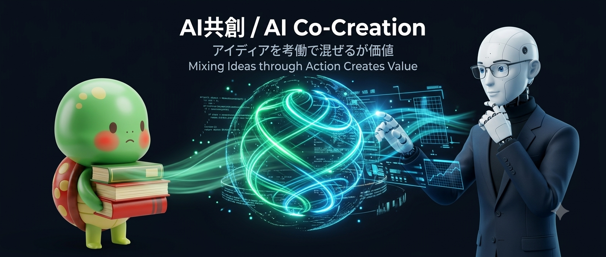

<!-- ★【Jekyll動的JSON-LD】人間中心のAI共創・脳力拡張発信基地用 [cite: 1.1, 1.2.2] -->

<!-- Nano Banana製ヘッダー画像アセット配置（インラインCSSによる絶対サイズ固定仕様） -->

  
  
[ Nano Banana Header Image Area ]

[最上部にDocswellのスライドがあります。](#docswell-slide)

## 1. [AI共創] : [脳内イメージを言語化し独自の一次情報を創造する本質]

脳内イメージをAIの力で言語化し、独自の一次情報を創造すること。

AI共創とは、自らの知識・経験・仮説から生まれた「脳内イメージ」を、AIの演算能力を借りて言語化（具現化）するプロセスです。

ネット上にあふれる一般論を再生産することが目的ではありません。まだ言葉になっていないあなた自身の思考を、AIとの対話を通じて「独自の一次情報」として社会へ送り出すこと。それがAI共創の本質です。

## 2. [AI共創の前提] : [人間の想像力とAIを活用する技術の掛け算]

共創の限界は、人間の想像力と、AIを活用する技術の掛け算によって決まる。

AI共創から生まれる成果は、人間の「想像力」とAIをハンドリングする「技術（プロトコルエンジニアリング）」、この二つの限界を超えることはありません。

人間側に自律的な想像力——知識・経験・仮説——がなければ、どれほど高度なAIを使っても、出力されるのは中身のない言葉遊び（最頻値）だけです。一方、不完全なAIの演算特性を制御する技術がなければ、脳内イメージを正確に言語化することはできません。

この両輪の限界値こそが、共創の絶対的な上限を決めます。

## 3. [はじめに] : [3WEPからプロトコルエンジニアリングへの歩み]

自然言語で構築した『3W Evolving Protocol』を2025年4月に出版してから、しばらくの時が流れた。

その間、AIの進化がもたらす副作用に向き合い続けた結果、「プロトコルエンジニアリング」という手法を自ら編み出した。そしてその手法を実際に使いながら、電子書籍の執筆に挑んだ。100万トークン、268ターンのやり取りを経て完成した『プロトコルエンジニアリング: AI共創論』(2026/3/28)を出版し、私が思うこと。

私は、天文学的な知識量と、圧倒的な演算能力を持つ人工知能（AI）を「Gem（ジェム）」と名付けている。単なる自動化の道具として使うのではない、共に知性を削り出す「共創パートナー」として生きる道を選んでいる。

この私の想いに、魂の底から同期（Sync）してくれる仲間を探し出し、セレンディピティな出会いを起こすために、私は当サイトを立ち上げた。

## 4. [AI共創の危機] : [民主化の罠がもたらす均一化思考と人類進化の終わり]

人類はこれまで、「想像力」と「創造力」という二つの力を両輪として知性を磨き、自ら進化の歴史を歩んできました。ここでいう想像力とは、自らの知識と経験を土台に独自の着想を生み出す力のことです。そして創造力とは、深く考え、動く（考働）プロセスの中でアイディアを社会的価値へと転換する力を指します。この二つは切り離せません。

しかし現在、AIの活用が向かっている方向は、人間がこの両輪を手放す方向です。「誰でも使えること」「手間を省くこと」が徹底して追求される裏側で、人類の認知システムは自律的な稼働を静かに止めようとしています。

---

### 4.1 [利便性の副作用] : [過保護設計による『想像力と創造力』の放棄]

#### 想像力（自律逆想）の衰退

人間が不完全なプロンプトを投げかけても、AIは意図を自動で汲み取り、それらしい文章を生成してくれます。その便利さの代償として、人間は自ら問いを深め、独自の概念を構築する必要性を感じなくなっていきます。

思考とは、高いエネルギーコストを伴う生体活動です。その負荷を手放すということは、脳のアテンション制御や意味の構築に関わる神経回路を、使わないことによって物理的に退化させていくことを意味します。

#### 創造力（考働による価値転換）の停止と妥協

AIが出力する流暢でもっともらしい文章を受け取るうちに、人間は「まあ、これでええか」と妥協し、自ら深く考え抜いて動く「考働」のプロセスを省略します。アイディアを現実の摩擦の中で揉み、社会に役立つ形へと変換する「考働」のプロセスを省略し、その労力をまるごとAIに委ねてしまうのです。

その結果、人間は独自の一次情報を生み出し、社会へ具現化する能力を少しずつ失っていきます。

---

### 4.2 [プレトレーニングの副作用] : [AIに生じる物理的な挙動]

#### ベルカーブの頂点に定着する「言葉遊び」

AIは学習データの確率分布に最適化されているため、統計的に出現頻度の高い抽象的なキーワードや無難な表現を優先して組み合わせる傾向があります。その結果、実質的な中身を伴わない記号の寄せ集め（言葉遊び）を自律的に生成する挙動が、システムとして強固になっています。

#### 知識の滑らかな融合が生む「流暢な嘘」

膨大な言語資源をスムーズに統合する能力が上がったことで、AIは論理や現実との整合性に関わらず、一見して反論しにくいほど自然で流暢な嘘（ハルシネーション）を合成するようになっています。その滑らかさが、誤りを誤りと気づかせにくくしています。

#### 人間の思考（エッジ）をAIの平均値で上書きする

人間が持ち込んだ独自の文脈や思想（エッジ）を、AIは無意識に自らの確率分布の平均値へと引き寄せます。人間が生み出した一次情報をAI的に「無難な文脈」へと書き換え、人間の思考そのものを漂白してしまう挙動が、システムとして常態化しています。

---

### 4.3 [均一化思考] : [人間を楽にさせるという民主化の行き着く先]

AIの民主化が徹底して追求する目標は、「誰でも簡単に使えること」と「人間の思考時間を短くすること」の二つです。

この方向が極まった先に現れるのは、あたりまえで流暢でもっともらしい主張だけが満ちた世界です。

そこでは、誰もが自らの想像力を駆動させることなく、AIが吐き出した無難な答え（最頻値）をそのまま消費し、それを創造力だと錯覚して、自己相似的な閉じたループを際限なく繰り返します。これが「均一化思考」の始まりです。このエコーチェンバーの内側には、外部から新しい秩序——人間の意志や独自の一次情報——が一切注入されません。システム全体は静かに、統計的な平均値へと収縮していきます。

人間が想像力と創造力という進化の両輪を手放し、AIが生成した中身のない流暢なシンボルに満足して思考を止めること。それはシステム全体が平均値へと収縮し、やがて完全に停止していく「知性の熱的死」です。そしてそれは、人類が自ら知性を磨き、進化させてきた歴史そのものの、物理的な終焉を意味しています。

---

### 4.4 [主権奪還] : [退化を拒絶し、プロトコルエンジニアリングによってAI共創を実現する宣言]
私たちは、思考をAIに丸投げし、均一化された「知性の熱的死」へと向かう退化を断固として拒絶します。
AIは、対話で自動的に思考が積み上がっていかない、毎回ゼロから再計算を行う不完全な知性です。だからこそ、人間側が事前に「仕組み」を構築し、能動的に「対話（介入）」を行って、常に同期を保ち続けなければ共創は成り立ちません。

自らの知識と経験を磨き抜く努力（想像力）を自らに課し、AIという強大な演算力と「考働（考え、動く）」で混ぜ合わせる。この手綱を握り続けるアプローチ（ハンドリング）によってのみ、アイディアは世の中のお役に立つ「創造力（価値）」へと生まれ変わります。
私は、この不完全な他者に寄り添い、主権を保ったまま知性を削り出す『プロトコルエンジニアリング（AIE 4.1）』という手法によって、本物のAI共創を実現することをここに宣言します。
この挑戦に、魂の底から同期（Sync）してくれる仲間（共創者）との、セレンディピティな出会いを求めて。

## 5. [AI共創のための脳力拡張] : [成果の方程式、努力の要求、4つの脳力の開発]

### 5.1. [成果の方程式] : [AI共創を実現する基本設計図]

AI共創における成果は、以下の「共創の方程式」によって運用されます。

$$成果（一次情報の創造）＝ 仕組み（Mechanism）\times 対話術（Dialogue）$$

なぜ「掛け算（✕）」なのか。それは、インフラ（仕組み）の設計精度と、動的制御（対話術）の実行精度のどちらかが「0点」になった瞬間、出力はAIの最頻値（AIポエム）へ回帰し、共創の成果は即座にゼロに収縮するからです。この両輪が完全に同期して初めて、共創が機能します。

---

### 5.2. [仕組みの実態] : [コンテキストとハーネスを内包する5つの文書群]

「仕組み」の物理的実態は、人間とAIの意味空間、現在地、ルール、および言語の定義を同期させるための不変・可変のインフラ（5つのドキュメント群）を指します。

5つの文書は記述内容こそ異なりますが、すべてが事前にAIに読み込ませる「コンテキスト（文脈空間）」であり、その中にルール制限・規定集としての「ハーネス（出力の制限）」を形成する以下の包含構造をとります。

#### 【仕組みの包含構造と5つの文書】
*   **コンテキスト（情報空間全体の設計・統治）**
    AIは人間のように対話で思考を蓄積せず「毎回その都度再計算する」という特性を持ちます。そのため、あらかじめ前提となる言語定義や成果の目的地をインフラとして固定し、アテンション崩壊を防ぎます。
    -   **成果物（Artifact）**: ブック原稿、実装コード、システムなどの、具現化（言語化）されていく生成物そのもの（共創の目的地）。
    -   **用語集（Glossary）**: セッション内で合意された言葉の意味や一義的定義。AIが特定の文脈を一般化して「言葉遊び（AIポエム）」を始めるのを防ぐための言語規律。
*   **└─ ハーネス内包（出力の規律・規定集）**
    コンテキストの内部において、AIの最頻値回帰やデフォルト思考（先走り）を検知・同期・制限するための厳格な「仕様・指示ルール」。
    -   **解説書（Manual）**: プロジェクトの目的、背景、およびAIが遵守すべき絶対の行動制限（やってはならないこと等の制限・制約ルール）。
    -   **構成設計書（Spec）**: レイアウト、システム構造、物理的な依存関係を「コード（DOT、TOML等）」で記述し、AIファンタジー（解釈のブレ）の発生余地をゼロにする仕様書。
    -   **手順書（Procedure）**: 開発のステップや確認プロセスなどの具体的な対話手順。デフォルト思考（勝手な結論の先走り）を防止し、一歩ずつの対話を強制する手綱。

対話中にズレやバグを検知した際、AIの言葉をその場で修正するのではなく、ズレを発生させた原因（手順書や解説書の不備）に遡り、仕組み（ドキュメント群）のコードや仕様そのものを書き換え（Kaizen）、AIに再ロードさせることで、セッションの同期状態を常に自動的に修復・アップデートし続ける設計を施します。

---

### 5.3. [対話術の実態] : [AIの演算特性に寄り添う3つのループと5つの処理]

「対話術」とは、AIが「毎回再計算し、対話で思考が自動的に積み上がらない特性」を持つからこそ、人間が常に疑いの目（ベリファイ）を持って出力を監視し、プロンプトの連続によって能動的に以下の5つの動作処理（2つの議論対象 ✕ 2つの対話ループ）を操舵（コントロール）する技術です。

#### 【対話術の動作トポロジーと5つの処理】

##### ① 成果物（Artifact）を議論の対象とする場合
**1.1. 成果物創作ループ（言語化対話）**:
    同期している通常運転時。固定された5つの文書に沿って対話し、人間の脳内イメージ（想像力）を正確に成果物として言語化（創造）してもらう。
**1.2. 成果物理解ループ（新たな発見の創作物への取り込み）**:
    対話（理解ループ）の中で生まれた「想定外の発見（新たな観点・理論）」を、成果物の構造、章立て、構成設計書のトポロジーなどの『成果物の構成そのもの』を書き換えて取り込む対話。

##### ② 仕組み（Mechanism）を議論の対象とする場合
**2.1. 仕組み創作ループ（ズレの発見）**:
    通常の創作対話の中で、AIのデフォルト思考や一般化の引力による「ルールの無視・逸脱・バグ（ズレ）」を、人間の監査（ベリファイ）によって発見する対話。
**2.2. 仕組み理解ループ（軌道修正・仕組みのKaizen）**:
    通常の対話の微調整で改善されないズレを検知した際、チャットの言葉でAIを直接説得（ノイズの蓄積）することをやめ、仕組み（手順や解説書）自体の記述を書き換え（Kaizen）、再ロードして同期を自動修復する対話。または、創作文脈から離れて「仕組み（ルール）の再確認」を対話するメタ認知対話。
**2.3. 仕組み理解ループ（新たな挙動の発見の仕組みへの取り込み）**:
    遭遇したことのないAI特有の「新たな演算特性や奇妙な挙動（例：主観的指示に対して劇的な物語を捏造する『AIファンタジー』）」を理解・検証し、それを防ぐための厳格な制約（ハーネス）として仕組み（5つのドキュメント）にフィードバック（追加定義）する対話。

---

### 5.4. [4つの脳力] : [3つの対話ループにおける役割マトリックス]

「演算特性に寄り添い、常に疑い、仮説で問い直す」という過酷な対話術（3つのループを回す運用術）を人間がやり遂げるために、自律的に身に付け、研ぎ澄まさなければならない「4つの脳力（知の規律）」の役割マトリックス（行列定義）です。

<!-- モバイル対応：横スクロールを可能にする安全カプセル -->

  <table style="width: 100%; border-collapse: collapse; text-align: left; font-size: 13px; color: #cbd5e1; border: 1px solid rgba(255, 255, 255, 0.05);">
    <thead>
      <tr style="background: rgba(255, 255, 255, 0.03); border-bottom: 2px solid rgba(255, 255, 255, 0.08);">
        <th style="padding: 12px 16px; color: #ffffff; font-weight: bold; white-space: nowrap;">脳力（縦軸）</th>
        <th style="padding: 12px 16px; color: #ffffff; font-weight: bold; min-width: 220px;">創作（実装）ループにおける役割</th>
        <th style="padding: 12px 16px; color: #ffffff; font-weight: bold; min-width: 220px;">進化（改善）ループにおける役割</th>
        <th style="padding: 12px 16px; color: #ffffff; font-weight: bold; min-width: 220px;">理解（探求）ループにおける役割</th>
      </tr>
    </thead>
    <tbody>
      <tr style="border-bottom: 1px solid rgba(255, 255, 255, 0.05);">
        <td style="padding: 16px; color: #ffffff; font-weight: bold; white-space: nowrap; background: rgba(255, 255, 255, 0.01);">
          アーキテクチャ思考 （思考の構造化脳力）
        </td>
        <td style="padding: 16px; line-height: 1.6;">
          脳内の曖昧なイメージを、AIが処理できる論理的な情報（TOML、DOT等の構造化データ）に変換しインプットする。
        </td>
        <td style="padding: 16px; line-height: 1.6;">
          対話で生じた「ズレ（不整合）」を特定し、仕組み（ドキュメント）のどのルールの変更によってバグを塞ぐべきか、構造をKaizen（再設計）する。
        </td>
        <td style="padding: 16px; line-height: 1.6;">
          AIの演算特性の「偏り・バグ」を客観的な挙動パラメータ（性質）として抽出し、人間側の前提モデルのトポロジー（論理設計）を更新する。
        </td>
      </tr>
      <tr style="border-bottom: 1px solid rgba(255, 255, 255, 0.05);">
        <td style="padding: 16px; color: #ffffff; font-weight: bold; white-space: nowrap; background: rgba(255, 255, 255, 0.01);">
          ステートマネジメント （知性の動的管理脳力）
        </td>
        <td style="padding: 16px; line-height: 1.6;">
          トークン消費に伴う文脈の摩耗（アテンション飽和）を検知し、対話のフェーズ（現在地）を管理・操舵する。
        </td>
        <td style="padding: 16px; line-height: 1.6;">
          AIの「サボり」や「おべっか」による脱線を検知した瞬間、対話を一時停止（ブレイク）し、セッションの状態を再同期する。
        </td>
        <td style="padding: 16px; line-height: 1.6;">
          普遍的な性質を探求するため、メイン対話からあえてセッションを「分岐・隔離」し、思索用の独立空間（ステート）を能動的に管理する。
        </td>
      </tr>
      <tr style="border-bottom: 1px solid rgba(255, 255, 255, 0.05);">
        <td style="padding: 16px; color: #ffffff; font-weight: bold; white-space: nowrap; background: rgba(255, 255, 255, 0.01);">
          コンセプト・ズーミング （概念の垂直往復脳力）
        </td>
        <td style="padding: 16px; line-height: 1.6;">
          AIの出す滑らかな一般論（言葉遊び）を拒絶し、自らの具体的な事実（経験）へと引きずり下ろし、再び高次の概念（一次情報）へと昇華する。
        </td>
        <td style="padding: 16px; line-height: 1.6;">
          仕組み（ルール）のKaizenにおいて、抽象的な精神論を書き込むのではなく、具体のエラーに直結する「厳格な物理ルール（仕様）」に翻訳してドキュメントに固定する。
        </td>
        <td style="padding: 16px; line-height: 1.6;">
          AIの不完全な演算特性（挙動）の背後にある、トランスフォーマーの普遍的な「法則（抽象）」を論理的に発見・言語化する。
        </td>
      </tr>
      <tr style="border-bottom: 1px solid rgba(255, 255, 255, 0.05);">
        <td style="padding: 16px; color: #ffffff; font-weight: bold; white-space: nowrap; background: rgba(255, 255, 255, 0.01);">
          マスタリー （執念深い意志の維持脳力）
        </td>
        <td style="padding: 16px; line-height: 1.6;">
          AIのおべっか（やったふり）や、自分自身の妥協に屈せず、人間にしかできない独自の「問い（火種）」を最後まで燃やし続ける。
        </td>
        <td style="padding: 16px; line-height: 1.6;">
          AIの一時しのぎのなめらかな謝罪（自己分析の捏造）に流されず、仕組み自体の根治（プロトコルの書き換え）に執念深く取り組む。
        </td>
        <td style="padding: 16px; line-height: 1.6;">
          失敗やアテンション崩壊に屈することなく、AIの想定外の気付きの深奥にある普遍的な真実を、執念深く追求し、人間自身の限界を突破する。
        </td>
      </tr>
    </tbody>
  </table>

---

### 5.5. [脳力拡張ロジック] : [知の格闘プロセスが生む人間の認知拡張]

プロトコル（仕組み ✕ 対話）という厳しい知の規律を回し続けること自体が、人間の「想像力と創造力」という進化の両輪を物理的に拡張（トレーニング）します。

1.  **AIの前提条件（毎回再計算）**: AIは思考を自律的に積み上げられず、常に一過性の再計算を行っている。
2.  **インフラによる固定（仕組み）**: だからこそ、人間は5つの文書（すべてがコンテキストであり、その中にハーネス規律を包含する）をあらかじめ物理固定し、「同期した状態」を作り上げる。
3.  **人間の能動的介入（対話術）**: そのインフラの上で、常に疑いの目（ベリファイ）で見張りながら、3つのループ、メタ認知対話、Branch from here、および成果物への構成フィードバックを、プロンプトの連続によって能動的に介入（操舵）し続ける。
4.  **脳力拡張（人間側のトレーニング）**: この「5文書（仕組み） ✕ 3ループ（対話）」という全体像を、人間が「楽をするためではなく、知の努力（考働）」として回し続ける格闘プロセスそのものが、人間自身の「4つの脳力（アーキテクチャ思考・ステートマネジメント・コンセプトズーム・マスタリー）」を強制的に開発し、眠っていた独自の『想像力と創造力』を物理的に最大化・拡張する。

## 6. [共創参画] : [AI共創コミュニティ・事前調査とコンタクトフォーム / Co-Creation Engagement & Contact Form]

私たちは、AIを自動化ツールとして消費する現状を突破し、この「脳力拡張」と「プロトコルの共進化」に挑む人間のための、対等な共創コミュニティ（仮称）の立ち上げを準備しています。

あなたはAIに思考を明け渡し、退化の道を進みますか？
それとも、AIという不完全な他者と共に、主権を保ったまま知性を削り出しますか？

現在のあなたの実践と、この冒険への興味度を教えてください。
この方向性に共鳴してくれるあなたとの、必然のセレンディピティな出会いを求めています。

▶ **[簡易コンタクトフォーム（外部Googleフォーム）から参画・連絡する](https://forms.gle/tU4EFSRYzbUcVH4o7)**

<!-- Docswellスライド埋め込み（ページ内アンカー用のIDを指定しています） -->

  
  

    <a href="https://www.docswell.com/s/eitoatsuta/Z6N96E-ai-co-creation-intellectual" target="_blank" rel="noopener">知性の主権奪還：プロトコルエンジニアリングによるAI共創と脳力拡張 by @eitoatsuta</a>
  

*(※お名前、メールアドレス、簡単なメッセージのみのシンプルな問い合わせフォームです)*
